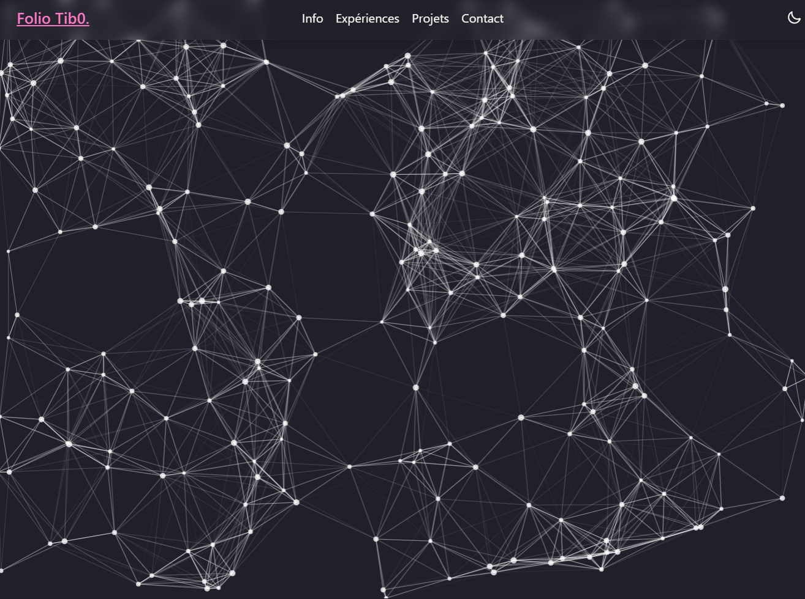

# Tib0-portfolio

This project is a showcase made with ❤️‍🔥, 👓 and 💻. It is a customizable portfolio. It display my professional path. 

### [Demo available here.](https://tib0-portfolio.netlify.app)

This is a [Next.js](https://nextjs.org/) project bootstrapped with [`create-next-app`](https://github.com/vercel/next.js/tree/canary/packages/create-next-app).

I used the following library to achieve my goals:
 - React
 - Gray Matter
 - DaisyUI
 - tsParticles

## Getting Started

First, run the development server:

```bash
npm run dev
# or
yarn dev
# or
pnpm dev
# or
bun dev
```

Open [http://localhost:3000](http://localhost:3000) with your browser to see the result.

You can start editing the page by modifying `app/page.tsx`. The page auto-updates as you edit the file.

This project uses [`next/font`](https://nextjs.org/docs/basic-features/font-optimization) to automatically optimize and load Inter, a custom Google Font.

## Particles

Display a moving web behind hero section.



## Data stored in md files

I've used Gray Matter to read from markdown files. We used this library to behave as a headless CMS.

> **tib0-portfolio\_data\experiences** 
> 
> ```
> type ExperienceType = {
>   slug: string;
>   title: string;
>   year: string;
>   excerpt: string;
>   date: string;
>   skills: [string];
> };
> ```

> **tib0-portfolio\_data\projects** md files store
> 
> ```
> type ProjectType = {
>   slug: string;
>   title: string;
>   date: string;
>   coverImage: string;
>   excerpt: string;
>   skills: [string];
> };
> ```

## Use of local storage

I store locally a value wether dark mode is activated or not.*TODO*

## Hooks

I've used three hooks here to gain informations about device used, theme selected (light or dark) and to factorize local storage usage.

> **tib0-portfolio\hooks**
> - useDeviceDetect
> - usePersistentStorageValue
> - useThemeDetect

## Serving

The site is served with [Netlify](https://www.netlify.com) services.

## Thanks

- **Vercel** sample blog : <https://github.com/vercel/next.js/tree/canary/examples/blog-starter>
- **Free Code Camps** hooks article : <https://www.freecodecamp.org/news/how-to-create-react-hooks/>
- **Radizon** storage : <https://radzion.com/blog/hook-storage>
- **Daisy UI** : <https://daisyui.com>
- **tsParticles** : <https://particles.js.org>
